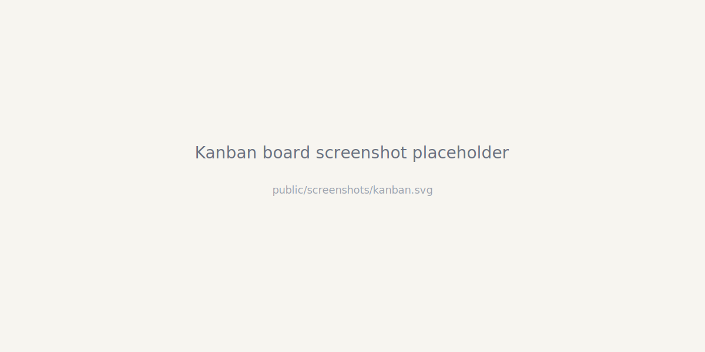
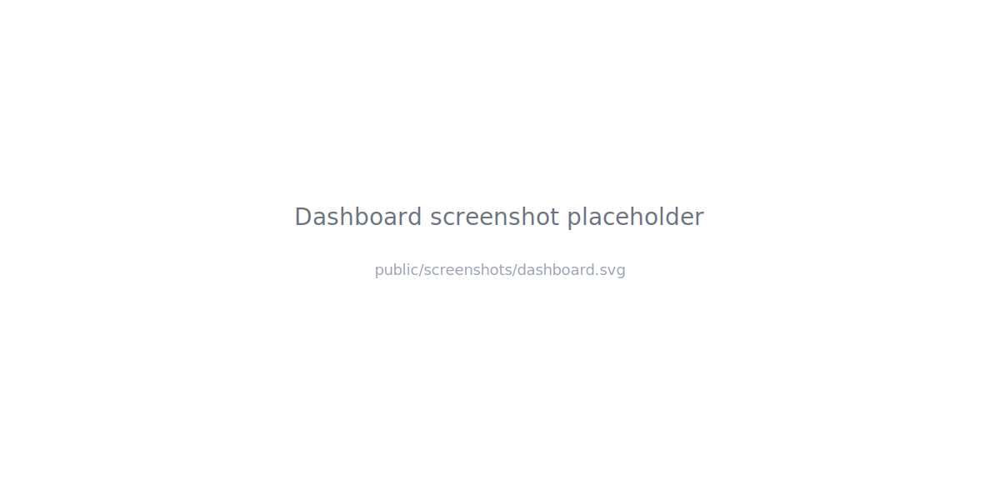
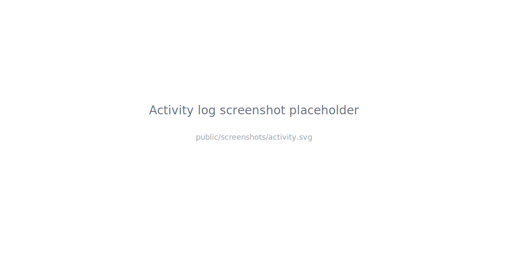

# Job Search HQ

One place to run your entire job search — track applications, stay on top of follow-ups, and keep weekly momentum visible.

**Open the app:** https://dashboard.michaelballin.com

---

## What you get

- **A Kanban board for applications** — Drag cards from Saved → Applied → Interviewing → Closed. Every move is timestamped and logged.
- **A daily dashboard** — See your top tasks, weekly targets, and streak at a glance so you know what to do first.
- **An activity log** — Everything you do is tracked: applications, meetings, outreach. Use it to review what changed each week.
- **Job boards & search strings** — Save your go-to boards and LinkedIn/Boolean search strings for quick reuse.
- **Profile & pitch storage** — Keep your elevator pitch and proof points ready to paste into messages.
- **Weekly recap emails** — Monday morning summary of last week's activity and what needs attention (opt-out in Settings).
- **Export & import** — Back up everything to a single JSON file and restore when needed.

## How it works

1. Create an account at https://dashboard.michaelballin.com with your email and password.
2. Add jobs to your Kanban board — paste URLs, add notes, and drag between columns.
3. Use the dashboard daily — check off tasks, log meetings and outreach, track your weekly targets.
4. Let the app handle the bookkeeping so you can focus on outreach and interviews.

## Screenshots

## Built with

- React + Vite frontend on Cloudflare Pages
- PocketBase backend on Oracle Cloud
- Express API proxy with Caddy reverse proxy
- No external UI libraries — custom inline styles

---

## For developers

If you want to run the project locally or contribute, start here:

- [Local development setup](docs/LOCAL-DEVELOPMENT.md)
- [Architecture and data flow](docs/ARCHITECTURE.md)
- [Product roadmap](docs/ROADMAP.md)
- [Server operations runbook](docs/ops/SERVER-RUNBOOK.md)
- [Production verification log](docs/ops/PROD-VERIFICATION.md)

### Doc authority

| Question | Where to look |
|---|---|
| How does the system work? | [ARCHITECTURE.md](docs/ARCHITECTURE.md) |
| How do I run it locally? | [LOCAL-DEVELOPMENT.md](docs/LOCAL-DEVELOPMENT.md) |
| What is shipped? What is next? | [ROADMAP.md](docs/ROADMAP.md) |
| How do I deploy or fix the server? | [SERVER-RUNBOOK.md](docs/ops/SERVER-RUNBOOK.md) |
| Coding rules for AI agents? | [AGENTS.md](AGENTS.md) |

If two docs disagree, trust ARCHITECTURE.md + current code for technical questions, ROADMAP.md for product status, and SERVER-RUNBOOK.md for operations.

